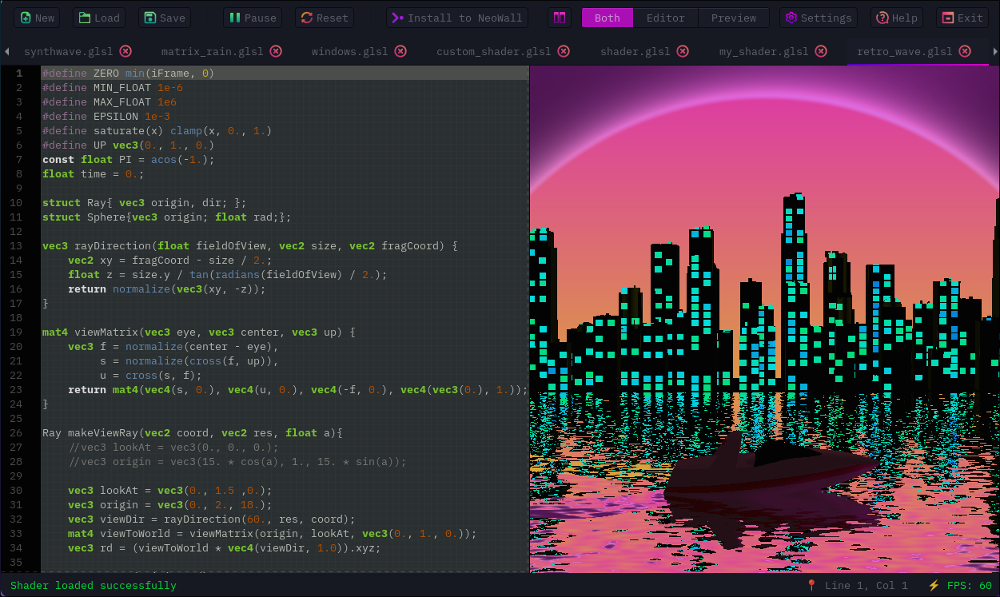

# gleditor 🎨✨

<p align="center">
  
</p>

<p align="center">
  
  
  
  
  
</p>

<p align="center">
  <strong>The Shader Editor That Actually Works™</strong>
</p>

<p align="center">
  A standalone OpenGL ES shader editor that doesn't make you want to flip your desk.<br/>
  Create, test, and debug GLSL shaders with real-time preview and syntax highlighting.<br/>
  <em>Because life's too short to edit shaders in Notepad.</em>
</p>

---

## 🤔 Why gleditor?

Let's be real: editing shaders shouldn't feel like debugging assembly code in the dark. We created **gleditor** because:

- ✅ Vim + shader crashes in the background = **masochism** (we're eliminating that)
- ✅ Copying from Shadertoy and praying it works = **not a workflow**
- ✅ Recompiling every 5 seconds to see if your `vec3` is actually pink = **inefficient**
- ✅ We needed a catchy name and "OpenGL_ES_Shader_Editor_v2_final_FINAL_actually_final.exe" was taken

**gleditor** gives you a proper IDE for GLSL shaders with live preview, syntax highlighting, autocomplete, and a tab system that won't ghost you when you have 47 shaders open.

---

## ✨ Features That'll Make You Go "Finally!"

### 🎨 **Live Preview**
See your shader running in real-time. Watch your beautiful plasma effect... or your accidental white square of shame. Either way, **instant feedback**.

### 📝 **GLSL Syntax Highlighting**
Because reading plain text GLSL is like reading the Matrix. We colorize your `vec3`s, `uniform`s, and `mainImage()` so your eyes don't bleed.

### 🔧 **OpenGL ES 2.0 / 3.0 / 3.1 / 3.2 Support**
We support all the versions. Yes, even ES 3.2 with geometry shaders. Yes, we tested it. No, our GPU didn't explode (much).

### 🎯 **Shadertoy Compatible**
Copy shaders from [Shadertoy](https://www.shadertoy.com) and they **just work**\*. Full support for:
- `iTime`, `iResolution`, `iMouse`
- `mainImage()` entry point
- Automatic uniform injection
- *(\*99% of the time. That 1% is on you for using triple-nested raymarching.)*

### 🗂️ **Multi-Tab Workflow**
Open multiple shaders at once. Switch between them with ease. Close tabs without losing work. Revolutionary, we know.

### 💾 **Save/Load Shaders**
- **Ctrl+S** to save
- **Ctrl+Shift+S** for Save As
- **Ctrl+O** to load
- Your work actually persists! What a concept!

### 🚀 **Auto-Compile Mode**
Enable auto-compile and watch your shader update **as you type**. It's like autocomplete but more judgy about your syntax errors.

### 📦 **Template Library**
Start with professionally crafted templates:
- 🌌 **Cosmic Tunnel** - Trippy wormhole effects
- 🌊 **Plasma** - Smooth animated gradients
- 🎱 **Raymarching Sphere** - 3D rendering starter
- 🔢 **Mandelbrot Set** - Infinite zoom fractals
- 💧 **Water Ripples** - Interactive wave simulation
- ✨ **Starfield** - Parallax space background
- 🎨 **Gradient** - Simple color transitions
- 📄 **Blank** - For the bold and the brave

### ⌨️ **170+ Autocomplete Items**
Type `mainI` → press **Tab** → get full Shadertoy template. We have keywords, functions, snippets, and all the GLSL built-ins you keep forgetting.

### 🎮 **Interactive Mouse Tracking**
Your shader gets `iMouse` uniform. Move your cursor, control the shader. Make interactive effects. Pretend you're a wizard.

### 🟢 **FPS Counter in Matrix Green**
Real-time performance monitoring at **#00FF41**. Because everything looks more professional in hacker green.

### 🐛 **Error Panel with Line Numbers**
Shader won't compile? We'll tell you **exactly** where you messed up (line 42, probably that missing semicolon).

### 🎨 **Customizable Everything**
- 12+ color themes (Solarized, Monokai, Dracula, you name it)
- Font size and family
- Tab width (2 or 4 spaces? We don't judge... much)
- Line numbers, bracket matching, smart home/end
- Split view orientation (horizontal or vertical)

### 💾 **Session Persistence**
Enable "Remember Open Tabs" and all your shaders will be there next time you open the app. Even unsaved ones. **Magic.**

### 🖼️ **Three View Modes**
- **Both**: Editor + Preview side-by-side
- **Editor Only**: Fullscreen code editing (preview paused to save GPU)
- **Preview Only**: Fullscreen shader preview (perfect for demos)

Tab bar **always visible** for instant shader switching. No more hunting through menus.

---

## 📸 Screenshots

<p align="center">
  
</p>

*Live shader editing with real-time preview, syntax highlighting, and multiple tabs. Retro vibes included.*

---

## 🚀 Installation

### Quick Install (Linux/macOS)

```bash
git clone https://github.com/yourusername/gleditor.git
cd gleditor
./install.sh
```

The automated installer will:
- ✅ Detect your OS and package manager
- ✅ Install all required dependencies
- ✅ Build the application
- ✅ Install system-wide
- ✅ Set up desktop integration

### Platform-Specific Installation

For detailed installation instructions including Windows, manual builds, and troubleshooting, see **[INSTALL.md](INSTALL.md)**.

**Quick links:**
- 🐧 [Linux Installation](INSTALL.md#linux-installation)
- 🍎 [macOS Installation](INSTALL.md#macos-installation)
- 🪟 [Windows Installation](INSTALL.md#windows-installation)
- 🔨 [Building from Source](INSTALL.md#building-from-source)
- 🐛 [Troubleshooting](INSTALL.md#troubleshooting)

### Requirements

- **GTK+3** (>= 3.20)
- **GTKSourceView 4**
- **OpenGL ES 2.0+** / **OpenGL** (platform-dependent)
- **C compiler** (GCC, Clang, or MSVC)
- **CMake** or **Make**

---

## 🎮 Usage

### Basic Workflow

1. **Launch gleditor**
   ```bash
   gleditor
   ```

2. **Create a new shader**
   - Click **New** or press **Ctrl+N**
   - Pick a template (or go blank if you're brave)

3. **Write your shader**
   - Use the Shadertoy `mainImage()` format
   - Access `iTime`, `iResolution`, `iMouse` uniforms
   - Watch the live preview update as you type (with auto-compile on)

4. **Save your work**
   - **Ctrl+S** to save
   - **Ctrl+Shift+S** to save as

5. **Install to NeoWall** (if applicable)
   - Click the **Install** button
   - Select shader type
   - Your wallpaper just got 10x cooler

### Keyboard Shortcuts (Because We're Not Animals)

| Shortcut          | Action                                    |
|-------------------|-------------------------------------------|
| **Ctrl+N**        | New shader (template picker)              |
| **Ctrl+O**        | Open shader file                          |
| **Ctrl+S**        | Save current shader                       |
| **Ctrl+Shift+S**  | Save As                                   |
| **Ctrl+W**        | Close current tab                         |
| **Ctrl+Q**        | Quit application                          |
| **Ctrl+R**        | Recompile shader                          |
| **Ctrl+Space**    | Trigger autocomplete                      |
| **F5**            | Toggle Editor/Preview view                |
| **F6**            | Toggle split orientation (H/V)            |
| **Space**         | Pause/Resume animation                    |
| **Tab**           | Indent selection                          |
| **Shift+Tab**     | Un-indent selection                       |

### Shadertoy Compatibility

gleditor supports the standard Shadertoy uniforms:

```glsl
uniform vec3 iResolution;     // Viewport resolution (in pixels)
uniform float iTime;          // Shader playback time (in seconds)
uniform vec4 iMouse;          // Mouse pixel coords (xy: current, zw: click)
```

**Example Shadertoy shader:**

```glsl
void mainImage(out vec4 fragColor, in vec2 fragCoord) {
    // Normalize coordinates to [0, 1]
    vec2 uv = fragCoord / iResolution.xy;
    
    // Animated gradient
    vec3 col = 0.5 + 0.5 * cos(iTime + uv.xyx + vec3(0, 2, 4));
    
    fragColor = vec4(col, 1.0);
}
```

Copy this into gleditor, hit Compile (or enable auto-compile), and watch the rainbow magic happen.

---

## ⚙️ Settings

Access via **Settings** button or menu. Configure:

### Appearance
- **Theme**: 12+ color schemes (Solarized Light/Dark, Monokai, Dracula, etc.)
- **Font**: Family and size
- **Line Numbers**: Show/hide
- **Current Line Highlight**: Enable/disable
- **Background Pattern**: Subtle grid for code alignment

### Behavior
- **Tab Width**: 2, 4, or 8 spaces
- **Auto-Indent**: Automatically indent new lines
- **Smart Home/End**: Home key jumps to first non-whitespace
- **Bracket Matching**: Highlight matching `()`, `{}`, `[]`
- **Auto-Completion**: Enable/disable GLSL autocomplete

### Compilation
- **Auto-Compile**: Compile shader as you type (slight delay)
- **Shader Speed**: Time multiplier (1.0 = normal, 2.0 = 2x speed)

### Session
- **Remember Open Tabs**: Restore tabs on restart (saves to `~/.config/gleditor/tabs_session.ini`)

All settings auto-save to `~/.config/gleditor/settings.conf`.

---

## 🐛 Debugging

### Shader Won't Compile?

1. **Check the Error Panel** (click the error icon in status bar)
   - Line numbers provided
   - Actual OpenGL error messages (not encrypted)

2. **Common Issues:**
   - Missing semicolons (classic)
   - Undeclared variables
   - Type mismatches (`float` vs `int`)
   - GLSL version issues (ES 2.0 vs 3.0 syntax)

3. **Enable Verbose Output:**
   ```bash
   gleditor --verbose
   ```

### Performance Issues?

- Lower shader complexity (raymarching = GPU torture)
- Check FPS counter (bottom right)
- Disable auto-compile if typing is laggy
- Pause preview when coding (saves GPU cycles)

### Crashes?

First, check if it's your shader or the editor:
1. Try a simple shader (gradient template)
2. If that works, your shader might be doing evil things (infinite loops, divide by zero, etc.)
3. If simple shaders crash, file a bug report with your GPU info

---

## 🔧 Development

### Project Structure

```
gleditor/
├── src/
│   ├── main.c                  # Entry point
│   ├── shader_editor.h         # Main editor API
│   ├── editor/                 # Editor components
│   │   ├── editor_window.c     # Main window & layout
│   │   ├── editor_text.c       # Code editor (GTKSourceView)
│   │   ├── editor_preview.c    # OpenGL preview widget
│   │   ├── editor_toolbar.c    # Toolbar buttons
│   │   ├── editor_statusbar.c  # Status bar (FPS, errors, etc.)
│   │   ├── editor_settings.c   # Settings dialog & persistence
│   │   ├── editor_tabs.c       # Tab manager
│   │   ├── editor_templates.c  # Shader template library
│   │   ├── glsl_completion.c   # Autocomplete provider
│   │   └── ...
│   └── shader_lib/             # Shader runtime & API
│       ├── neowall_shader_api.c
│       └── shader_core.c
├── include/
│   └── platform_compat.h       # Cross-platform compatibility layer
├── data/
│   ├── gleditor.svg            # Logo
│   ├── icon.svg                # Application icon
│   ├── gleditor.desktop        # Linux desktop entry
│   └── screenshot.png          # Screenshot
├── CMakeLists.txt              # CMake build system (cross-platform)
├── Makefile                    # Make build system (Unix)
├── install.sh                  # Automated installer (Linux/macOS)
├── install.bat                 # Automated installer (Windows)
└── INSTALL.md                  # Detailed installation guide
```

### Building from Source

See [INSTALL.md](INSTALL.md#building-from-source) for complete build instructions including:
- Make-based builds (Linux/macOS)
- CMake-based builds (all platforms)
- Build options and flags
- Cross-platform considerations

**Quick build:**
```bash
# Linux/macOS with Make
make
./bin/gleditor

# Any platform with CMake
mkdir build && cd build
cmake -DCMAKE_BUILD_TYPE=Release ..
cmake --build .
```

### Contributing

PRs welcome! Please:
- Keep code style consistent (see existing files)
- Test on your platform before submitting
- Add comments for non-obvious logic
- Update README if adding features

### Debugging Build Issues

```bash
# See full compilation commands
make V=1

# Check dependencies
pkg-config --modversion gtk+-3.0
pkg-config --modversion gtksourceview-4
pkg-config --modversion egl

# Check OpenGL ES support
ls /usr/include/GLES2/
ls /usr/include/GLES3/
```

---

## 📜 License

**MIT License** - See [LICENSE](LICENSE) file for details.

TL;DR: Use it, modify it, sell it, just don't sue us if your GPU catches fire.

---

## 🙏 Acknowledgments

- **GTK Project** - For the GUI toolkit
- **GTKSourceView** - For syntax highlighting magic
- **Shadertoy** - For inspiring a generation of shader wizards
- **Our GPUs** - For not dying during development (mostly)
- **Coffee** - The real MVP

---

## 🆘 Support & Contact

- **Bug Reports**: [GitHub Issues](https://github.com/yourusername/gleditor/issues)
- **Feature Requests**: Also GitHub Issues (tag as enhancement)
- **Questions**: GitHub Discussions or open an issue

---

## 🎯 Roadmap

Future features we're considering (no promises):

- [x] Cross-platform support (Linux, macOS, Windows)
- [x] CMake build system
- [x] Automated installers
- [ ] Shader export to various formats
- [ ] Multi-pass rendering
- [ ] Texture/image inputs
- [ ] Video export (render to mp4)
- [ ] Plugin system
- [ ] Cloud shader library
- [ ] Package managers (apt, homebrew, chocolatey)
- [ ] AppImage / Flatpak / Snap (Linux)
- [ ] AI-powered shader generation (kidding... unless? 👀)

---

## 💡 Tips & Tricks

1. **Use Ctrl+Space liberally** - 170+ autocomplete items await you
2. **Enable auto-compile** - Instant feedback = faster iteration
3. **Start with templates** - Don't reinvent the wheel (or the plasma effect)
4. **Watch the FPS counter** - If it drops below 30, your shader might be too ambitious
5. **Split view vertically on ultrawide** - More code visible at once
6. **Use F5 to toggle views** - Quick preview fullscreen
7. **Save often** - Ctrl+S is muscle memory for a reason
8. **Read OpenGL errors carefully** - They're cryptic but not malicious

---

<p align="center">
  Made with ❤️, ☕, and a questionable amount of <code>vec3</code>s
</p>

<p align="center">
  <em>gleditor - Because your shaders deserve better than Notepad</em>
</p>